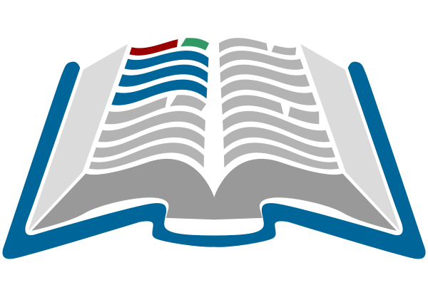

# Sobre el curso

## Descripción de la Asignatura

La asignatura tiene como objetivo proporcionar a
los estudiantes las competencias y destrezas básicas necesarias
para desempeñarse como Data Scientist utilizando el lenguaje de 
programación Python.

## Requisitos de entrada

* Fundamentos de Cálculo y Álgebra.
* Conceptos básicos de Probabilidad y Estadística.
* Conocimientos en Optimización.
* Familiaridad con el lenguaje de programación Python.

## Contenidos temáticos

El curso se organiza en torno a los siguientes temas principales:

* **Toolkit Básico**: Introducción a las herramientas esenciales para el análisis de datos.
* **Manipulación de Datos**: Técnicas para la manipulación eficiente de conjuntos de datos.
* **Visualización**: Métodos para visualizar datos de manera efectiva.
* **Machine Learning**: Introducción a los conceptos básicos y aplicaciones del aprendizaje automático.

## Recursos para el aprendizaje

1. **Texto Guía**:  
     * **Python Data Science Handbook** - Jake VanderPlas

2. **Complementaria/Opcional**:  
     * **Hands-On Machine Learning with Scikit-Learn, Keras, and TensorFlow** - Aurélien Géron
     * **Data Science from Scratch** - Joel Grus
     * **Python for Data Analysis** - Wes McKinney

## Evaluación

### Laboratorios 
- Semanal.
- Individual.
- Notas: 0, 25, 50, 75, 100.
- Plazo: final del día de clases.
- Entregas fuera del plazo tienen nota cero (0).  
    

### Tareas 

- Mensual.
- Individual.
- Plazo:
     - $T_1$: xx de Septiembre 2024.
     - $T_2$: xx de Diciembre 2024.
- Entregas fuera del plazo descuentan 25 puntos por día (parte entera). 
     - Por ejemplo, un retraso de 15 minutos cuenta como un día y descuenta 25 puntos.  
      

### Proyecto 

- Semestral.
- Plazo: final del curso (xx de Diciembre 2024).
- Individual.
- Entregas fuera del plazo descuentan 25 puntos por día (parte entera).  

### Nota Final

La nota final será el promedio ponderado
entre los laboratorios, tareas y el proyecto final del curso.

$$
N_f = 0.3\bar{n_l} + 0.35\bar{n_t} + 0.35n_p
$$

> **¡Importante!**: Todos los entregables se
> deben subir al repositorio personal del estudiante
> (en GitHub). Las notas se trataran de actualizar al final de cada mes.