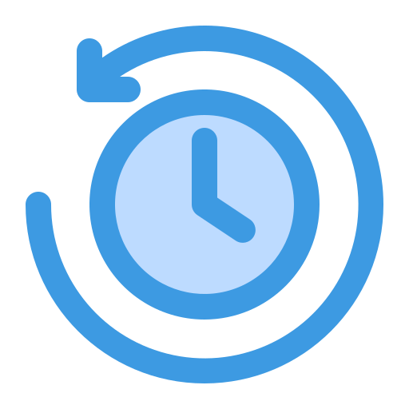

# Historia del curso

## Inicios del Curso

El curso **MAT281 - Aplicaciones de las Matemáticas** se concibió con la intención
de sumergirse en el mundo práctico de las matemáticas. Con la participación de
diversos profesores, cada uno con su especialización única, se exploraban diferentes 
áreas desde perspectivas variadas. 

Por ejemplo, si un profesor era experto en sistemas dinámicos, 
el curso se adentraba en fenómenos como la propagación de enfermedades.
Por otro lado, si el profesor destacaba en ecuaciones diferenciales, 
se aplicaban técnicas de resolución para problemas como la ecuación del calor. 
Esto significaba que no había un horizonte común definido de antemano, ya que cada año 
el curso tomaba un rumbo distinto según la experiencia y enfoque del profesor a cargo. 

Además, en sus inicios, el curso no se centraba en la programación, a diferencia de lo que 
ocurre en la actualidad.

La versión actual del curso, tal como la conocemos, se remonta al año 2014,
cuando el profesor **Sebastian Flores** reformuló el enfoque de MAT281, orientándolo
hacia aplicaciones más prácticas y didácticas, particularmente en programación (utilizando Python).

Aunque las primeras versiones abordaban temas como análisis numérico y análisis de datos , 
con un toque de aprendizaje automático, desde 2017, el curso ha evolucionado hacia una 
introducción al data science, gracias a los valiosos aportes de ayudantes y alumnos, 
especialmente de **Francisco Alfaro**, **Alonso Ogueda** y **Alberto Rubio**.

Es relevante mencionar que hasta el año 2019, el curso se dictaba exclusivamente
en la sede de Casa Central. Sin embargo, a partir de ese año, el profesor
**Francisco Alfaro** inició la enseñanza del mismo en la sede de San Joaquín.

Esta transición marcó el inicio de importantes modificaciones tanto en el contenido del 
curso como en su metodología de enseñanza. Entre los cambios más destacados se incluyó 
la integración de herramientas como GitHub y Google Colab, así como la adopción de
GitHub Actions y GitHub Pages para la documentación del curso.

## Estado del Curso

En la actualidad, el curso MAT281 cumple con los más altos estándares de calidad en su presentación. Aquí se detalla brevemente cómo funciona:

* **GitHub** se utiliza como repositorio principal para el curso.
* **Google Colab** permite trabajar con Python de manera colaborativa en la web.
* **Mkdocs**, junto con plugins adicionales, se emplea para crear la documentación estática del curso.
* **GitHub Actions** automatiza la generación de documentación y su publicación mediante **GitHub Pages**.

En cuanto al contenido, se busca mejorar continuamente tanto los temas como las evaluaciones. El curso se centra en los siguientes puntos:

**Toolkit Básico**:
* **Manipulación de Datos**: Técnicas eficientes para manipular conjuntos de datos.
* **Visualización**: Métodos efectivos para representar gráficamente los datos.
* **Machine Learning**: Introducción a los fundamentos y aplicaciones del aprendizaje automático.

Se solicita constantemente retroalimentación del curso para su mejora, tanto de profesores, 
colegas como de los propios alumnos.

## Agradecimientos

Se agradece enormemente a todas las personas que han contribuido a 
mejorar el curso, especialmente a los estudiantes que año tras año han 
brindado valiosos comentarios. A continuación, se mencionan los principales colaboradores 
en la versión actual del curso:

**Profesores**

* [Sebastian Flores](https://www.linkedin.com/in/sebastiandres/)
* [Alonso Ogueda](https://www.linkedin.com/in/aoguedaoliva/)
* [Francisco Alfaro](https://www.linkedin.com/in/faam/)

**Ayudantes**

* [Alberto Rubio](https://www.linkedin.com/in/arubiosu/)
* [Eric Zepeda](https://www.linkedin.com/in/eric-zepeda-3b6b9897/)

**Alumnos**

A todas las generaciones de ingenieros matemáticos que han formado parte de este curso. 
Su participación ha sido fundamental en su desarrollo y mejora continua.